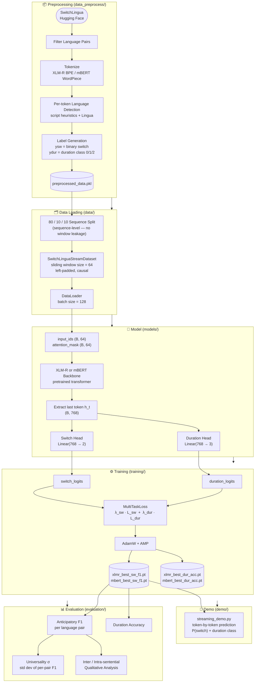
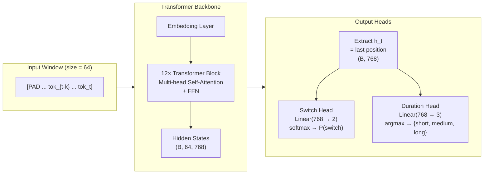
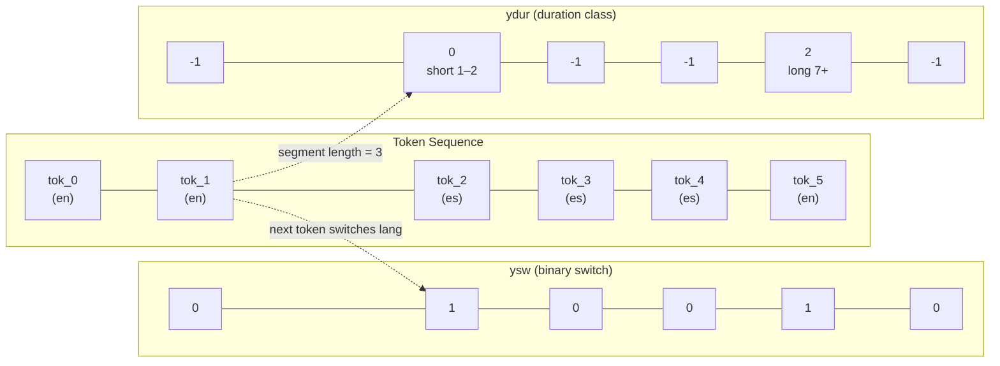

# Architecture: Multilingual Code-Switch Prediction

## Overview

This project predicts **token-level language switches** in multilingual (code-switched) text in a streaming, causal manner. Given a prefix of tokens, the model outputs:

1. **Switch probability** — will the next token switch language?
2. **Duration class** — if a switch occurs, how long will the new-language segment be? (short: 1–2, medium: 3–6, long: 7+ tokens)

Supported language pairs: Spanish–English, Chinese–English, Hindi–English, Arabic–English (trained); French–English, Korean–English (zero-shot).

---

## System Architecture Diagram



---

## Model Architecture Detail



---

## Label Schema



---

## Directory Structure

```
Multilingual_Code_Switch_Prediction-ML/
├── data/                       # Dataset loading & windowing
│   ├── data_utils.py           # Load pickle, split sequences, dataset stats
│   └── streaming_dataloader.py # SwitchLinguaStreamDataset (window-level)
├── data_preprocess/            # Raw → pickle preprocessing
│   ├── preprocess.py           # Main pipeline (Hugging Face → pickle)
│   ├── preprocess_util.py      # Language detection, tokenization, label generation
│   ├── preprocess_zeroshot.py  # Zero-shot pair preprocessing
│   └── duration_distribution.py
├── models/                     # Model architectures
│   ├── dual_head_model.py      # DualHeadCausalModel (main)
│   ├── single_head_model.py    # SingleHeadModel (ablation: switch only)
│   ├── naive_baseline.py       # Frequency-based baselines
│   └── causal_mask_builder.py  # Causal attention mask utilities
├── training/                   # Training & tuning
│   ├── train.py                # Main training loop + checkpointing
│   ├── losses.py               # MultiTaskLoss
│   └── tune.py                 # Hyperparameter sweep harness
├── evaluation/                 # Metrics & analysis
│   ├── evaluate.py             # Test-set evaluation (XLM-R vs mBERT)
│   ├── metrics.py              # Anticipatory F1, universality sigma
│   ├── qualitative_analysis.py # Inter/intra-sentential switch analysis
│   └── plot_universality.py
├── demo/                       # Interactive prediction demo
│   └── streaming_demo.py
├── scripts/                    # Shell scripts for training/eval runs
├── checkpoints/                # Saved model weights (.pt)
├── results/                    # Evaluation outputs (JSON, markdown, charts)
└── tests/
    └── test_streaming_dataloader.py
```

---

## ML Pipeline

```
Raw SwitchLingua data (Hugging Face)
         │
         ▼
  ┌─────────────────────────────────────────┐
  │  Preprocessing  (data_preprocess/)      │
  │  • Filter by language pair              │
  │  • Tokenize (XLM-R BPE / mBERT WP)     │
  │  • Detect per-token language            │
  │  • Generate ysw and ydur labels         │
  └──────────────────┬──────────────────────┘
                     │  preprocessed_data_*.pkl
                     ▼
  ┌─────────────────────────────────────────┐
  │  Data Loading  (data/)                  │
  │  • 80/10/10 sequence-level split        │
  │  • SwitchLinguaStreamDataset            │
  │    – sliding windows of size 64         │
  │    – each sample predicts token t+1     │
  │    – epoch-level dynamic resampling     │
  └──────────────────┬──────────────────────┘
                     │  (input_ids, attn_mask, ysw, ydur)
                     ▼
  ┌─────────────────────────────────────────┐
  │  Model  (models/)                       │
  │  Backbone: XLM-R or mBERT              │
  │    ↓ last hidden state h_t (B, 768)    │
  │  Switch head: Linear(768 → 2)          │
  │  Duration head: Linear(768 → 3)        │
  └──────────────────┬──────────────────────┘
                     │  (switch_logits, duration_logits)
                     ▼
  ┌─────────────────────────────────────────┐
  │  Training  (training/)                  │
  │  MultiTaskLoss:                         │
  │    L = λ_sw·L_sw + λ_dur·L_dur         │
  │  AdamW + AMP; save best F1 / best Acc  │
  └──────────────────┬──────────────────────┘
                     │
                     ▼
  ┌─────────────────────────────────────────┐
  │  Evaluation  (evaluation/)              │
  │  • Anticipatory F1 per language pair    │
  │  • Duration accuracy                    │
  │  • Universality sigma (σ of per-pair F1)│
  │  • Inter/intra-sentential analysis      │
  └─────────────────────────────────────────┘
```

---

## Key Components

### Data: `SwitchLinguaStreamDataset`

Each sequence is converted into overlapping windows of width 64. Window `t` ends at position `t`; labels describe position `t+1`. Left-padding is applied when the prefix is shorter than the window size. Sequences are split at the **sequence level** before windowing to prevent leakage.

```
sequence:  [tok_0, tok_1, ..., tok_N]
window t:  [PAD, PAD, ..., tok_{t-63}, ..., tok_t]  → predicts (ysw[t], ydur[t])
```

| Output field | Shape | Description |
|---|---|---|
| `input_ids` | `(B, 64)` | Subword token IDs |
| `attention_mask` | `(B, 64)` | 1 = real token, 0 = padding |
| `lang_ids` | `(B, 64)` | Integer language ID per token |
| `ysw_label` | `(B,)` | Binary: 1 if next token switches language |
| `ydur_label` | `(B,)` | Duration class (0/1/2), or -1 if no switch |

### Labels: generation logic

```
ysw[t] = 1  if next non-punctuation token differs in detected language
ydur[t] = 0  (1–2 tokens)    if ysw[t] == 1
           1  (3–6 tokens)
           2  (7+ tokens)
          -1  if ysw[t] == 0   (ignored in duration loss)
```

Language detection uses Unicode script ranges (Chinese, Hindi, Arabic) and accent/stopword heuristics (Spanish), with Lingua library as a fallback. A smoothing pass corrects isolated single-token misdetections.

### Model: `DualHeadCausalModel`

```
input_ids + attention_mask
        │
   XLM-R / mBERT backbone
        │
last hidden state (B, 64, 768)
        │  extract position -1
       h_t  (B, 768)
      ┌─┴─┐
      │   │
  Linear  Linear
  (768,2) (768,3)
      │       │
switch_logits  duration_logits
```

The last-position hidden state encodes the full left context under the pretrained transformer's attention, making a separate causal mask unnecessary for inference correctness.

### Loss: `MultiTaskLoss`

```
L_sw  = CrossEntropyLoss(switch_logits, ysw, weight=sqrt_inv_freq)
L_dur = CrossEntropyLoss(duration_logits, ydur, ignore_index=-1)
L     = λ_sw · L_sw + λ_dur · L_dur
```

Default: `λ_sw = 1.0`, `λ_dur = 0.5`. Class weights are optional (activated with `--weighted-loss`).

### Evaluation: `metrics.py`

| Metric | Definition |
|---|---|
| `anticipatory_f1` | Binary F1 with `pos_label=1` (switch class) |
| `duration_accuracy` | Accuracy over positions where `ydur != -1` |
| `universality_sigma` | Std dev of per-pair F1 (lower = more consistent across pairs) |

---

## Checkpoints

| File | Backbone | Optimized for | Size |
|---|---|---|---|
| `xlmr_best_sw_f1.pt` | XLM-R | Switch F1 | ~1.1 GB |
| `mbert_best_sw_f1.pt` | mBERT | Switch F1 | ~711 MB |
| `xlmr_best_dur_acc.pt` | XLM-R | Duration accuracy | ~1.1 GB |
| `mbert_best_dur_acc.pt` | mBERT | Duration accuracy | ~711 MB |

---

## Training Configuration

| Argument | Default | Description |
|---|---|---|
| `--backbone` | `both` | `xlmr`, `mbert`, or `both` |
| `--epochs` | `10` | Training epochs |
| `--lr` | `1e-5` | AdamW learning rate |
| `--lambda-sw` | `1.0` | Switch loss weight |
| `--lambda-dur` | `0.5` | Duration loss weight |
| `--window-size` | `64` | Sliding window length |
| `--sample-rate` | `0.2` | Fraction of windows per epoch |
| `--weighted-loss` | off | Enable sqrt inverse-freq class weights |
| `--single-task` | off | Ablation: switch head only |
| `--detach-dur` | off | Ablation: stop gradient from duration head |
| `--debug` | off | 1% data subsampling for fast iteration |

---

## Ablations & Baselines

| Variant | Description |
|---|---|
| `DualHeadCausalModel` | Full model (switch + duration heads) |
| `SingleHeadModel` | Switch head only |
| `--detach-dur` | Duration loss does not backprop into backbone |
| `NaiveSwitchPredictor` | Frequency table P(switch \| language_id) |
| `ZeroBaseline` | Always predicts no switch |

---

## Demo Usage

```bash
# Interactive
python demo/streaming_demo.py --model_path checkpoints/xlmr_best_sw_f1.pt

# Single command
python demo/streaming_demo.py \
  --model_path checkpoints/xlmr_best_sw_f1.pt \
  --language_pair "Spanish-English" \
  --text "Hola, how are you doing today?"

# Pipeline test (no checkpoint needed)
python demo/streaming_demo.py --dummy
```

Output table columns: `token | lang | P(switch) | anticipated_duration | flag`

---

## Dependencies

```
torch, transformers, datasets, scikit-learn, pandas, numpy,
lingua-language-detector, tqdm, tensorboard, matplotlib, seaborn,
huggingface_hub, pytest
```
