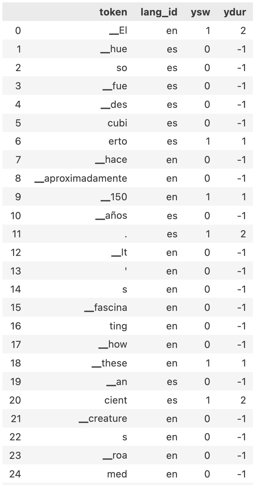

# Code-Switching Prediction with Multilingual Transformers

## 1. Introduction

This project investigates **token-level code-switching prediction** using multilingual transformer models.  
The objective is to preprocess mixed-language conversational data and generate structured labels for modeling language switching behavior.

The preprocessing pipeline supports multilingual input (e.g., Chinese–English code-switching) and prepares data for downstream predictive modeling.

---

## 2. Dataset Acquisition and Preprocessing

**Source:** Access the dataset via Hugging Face ([Shelton1013/SwitchLingua_text](https://huggingface.co/datasets/Shelton1013/SwitchLingua_text)).

**Language Coverage:** Selected diverse pairs from the 12 supported languages: Hindi–English, Mandarin–English, Spanish–English.

The dataset is preprocessed to include:

- **Tokenized sequences** of each `data_generation_result` entry.
- **Token-level language identification:** Use model-specific tokenizers (e.g., BPE for RoBERTa variants). For each tokenized sequence, we generate `lang_ids` — language label per subword token. Ensure subword segments are correctly mapped to their respective Language IDs.

---

## 3. Predictive Label Generation

Two types of labels for each token in a sequence:

1. **`ysw` (Switch Label):**  
   Binary indicator (0/1) of whether the next token (`t+1`) switches to a different language.

2. **`ydur` (Duration Label):**  
   Categorical label indicating the length of the upcoming code-switch segment.

| Class ID | Class Name | Burst Length | Rationale |
|----------|------------|--------------|-----------|
| 0        | Small      | 1–2 tokens   | Short, lexical insertions |
| 1        | Medium     | 3–6 tokens   | Phrase-level segments (NP/VP) |
| 2        | Large      | 7+ tokens    | Clausal or full-sentence switches |

### 3.1 Token-Level Output Structure

Each processed entry stored in the `preprocessed` column of `df_preprocessed.pkl` includes:

```python
{
    "original_text": str,
    "tokens": List[str],
    "lang_ids": List[str],
    "ysw": List[int],
    "ydur": List[int]
}
```
Visualized sample of token level output:


---
### 4. Installation
### 4.1 Clone Repository

```bash
git clone <https://github.com/JingjingJi94/Multilingual_Code_Switch_Prediction-ML->
cd <repository-name>
```

### 4.2 Create Virtual Environment (Recommended)
```bash
python -m venv ML-code-prediction
source venv/bin/activate        # macOS/Linux
venv\Scripts\activate           # Windows
```

### 4.3 Install Dependencies
```bash
pip install -r requirements.txt
```


